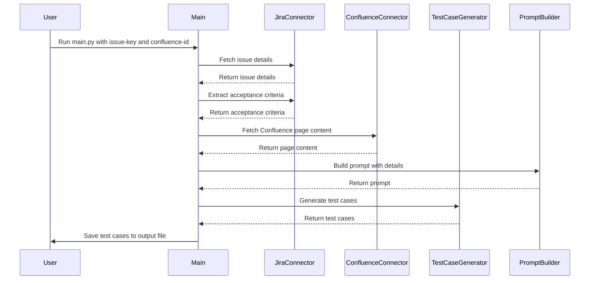

# FRIDAY - AI Test Case Generator

<p align="center">
  
</p>


A Python-based tool that uses Google's Vertex AI and LangChain to automatically generate test cases from Jira and Confluence documentation.

## Features

- 🤖 Leverages Google Vertex AI for test case generation
- 📝 Pulls requirements from Jira tickets
- 📚 Extracts context from Confluence pages
- 🔄 Uses LangChain for prompt engineering and chain management
- 💾 Outputs structured test cases in JSON format

## Sequence diagram 



## Prerequisites

- Python 3.13+
- Google Cloud Platform account with Vertex AI enabled
- Jira and Confluence access credentials

## Installation

1. Clone the repository:
```bash
git clone https://github.com/dipjyotimetia/friday.git
cd friday
```
2. Install dependencies:

```bash
chmod +x prerequisites.sh
./prerequisites.sh
poetry install
```

3. Configure environment variables:

```bash
cp .env.example .env
# Edit .env with your credentials
```

## Usage
Run the tool with:
```bash
poetry run python friday/main.py --issue-key PROJ-123 --confluence-id 12345 --output test_cases.json
```

Parameters
* `--issue-key`: Jira issue key (required)
* `--confluence-id`: Confluence page ID (optional)
* `--output`: Output file path for generated test cases (default: test_cases.json)

## Development
Run tests:

```bash
poetry run pytest
```

Format Code:

```bash
poetry run ruff format
```

