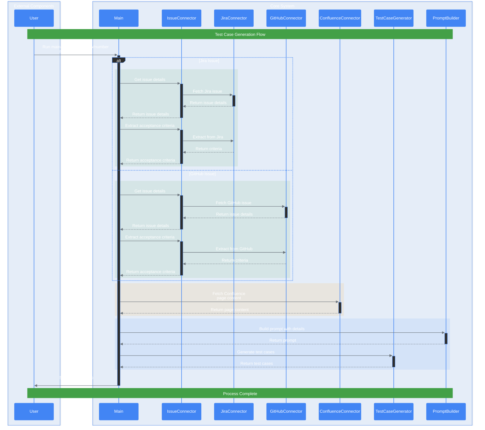

# FRIDAY - AI Test Agent

An AI-powered test agent that leverages Google Gemini and LangChain to automatically create test cases from Jira/GitHub issues and Confluence documentation, providing a seamless testing experience.

## 🚀 Features

- Generate test cases using Google Gemini or OpenAI
- Extract requirements from Jira tickets or GitHub issues 
- Integrate context from Confluence pages
- Process data using LangChain's prompt engineering.
- Store and search documents using ChromaDB vectorization.
- Export test cases in JSON or Markdown format
- Create embeddings using web crawler for additional context.

## 📋 Prerequisites

- Python >=3.12
- Google Cloud Platform account with Gemini enabled or OpenAI
- Jira/GitHub and Confluence access credentials

## 🔄 Sequence Diagram

<details>
<summary>Expand Sequence diagram</summary>



</details>

## ⚡️ Quick Start

1. Install via Homebrew:
```bash
brew tap dipjyotimetia/friday
brew install friday
```

2. Run setup:
```bash 
friday setup
```

3. Generate test cases:
```bash
# From Jira
friday generate --jira-key PROJ-123 --confluence-id 12345 -o test_cases.md

# From GitHub
friday generate --gh-issue 456 --gh-repo owner/repo --confluence-id 12345 -o test_cases.md
```

## 📖 Usage Options

### Web Crawler
```bash
# Crawl single domain
friday crawl https://example.com --provider vertex --persist-dir ./my_data/chroma --max-pages 5

# Crawl multiple domains
friday crawl https://example.com --provider vertex --persist-dir ./my_data/chroma --max-pages 10 --same-domain false
```

### Command Reference
```bash
friday --help          # Show all commands
friday version         # Display version
friday generate --help # Show generation options
```

### Parameters
- `--jira-key`: Jira issue key
- `--confluence-id`: Confluence page ID (optional)
- `--gh-issue`: GitHub issue number
- `--gh-repo`: GitHub repository (format: owner/repo)
- `--output`: Output file path (default: test_cases.md)
- `--provider`: AI provider (vertex/openai)

## 💻 Development

1. Clone and setup:
```bash
git clone https://github.com/dipjyotimetia/friday.git
cd friday
chmod +x prerequisites.sh
./prerequisites.sh
```

2. Configure environment:
```bash
cp .env.example .env
# Add your credentials to .env
```

3. Run Tests:
```bash
# Run tests
poetry run pytest tests/ -v
```

4. Format Code:
```bash
# Format code
poetry run ruff format
```

6. Deploy to google cloud
```bash
chmod +x deploy.sh
PROJECT_ID="your-project" REGION="us-west1" ./deploy.sh
```

<details>
<summary>Development Container Setup</summary>

## Development Container Setup

This project uses Visual Studio Code's Development Containers feature, providing a consistent development environment via Docker.

### Prerequisites

1. [Visual Studio Code](https://code.visualstudio.com/)
2. [Docker Desktop](https://www.docker.com/products/docker-desktop)
3. [Dev Containers extension](https://marketplace.visualstudio.com/items?itemName=ms-vscode-remote.remote-containers)

### Features

- Python 3.12 with Poetry package management
- Node.js 22 with npm
- Docker-in-Docker support
- Pre-configured VS Code extensions:
  - Python and Pylance
  - ESLint
  - Prettier
  - Docker
  - Ruff (Python linter)

### Environment Variables

Required environment variables (set these before opening the dev container):

```sh
GOOGLE_CLOUD_PROJECT
GOOGLE_CLOUD_REGION
GITHUB_ACCESS_TOKEN
GITHUB_USERNAME
JIRA_URL
JIRA_USERNAME
JIRA_API_TOKEN
CONFLUENCE_URL
CONFLUENCE_USERNAME
CONFLUENCE_API_TOKEN
```

## Services

The development environment includes three services:

- `workspace`: Main development container
- `api`: FastAPI backend service (port 8080)
- `app`: Frontend application (port 3000)

## Getting Started

1. Clone the repository
2. Copy .env.example to .env and fill in your credentials
3. Open in VS Code
4. Click "Reopen in Container" when prompted
5. The container will build and install all dependencies automatically

</details>