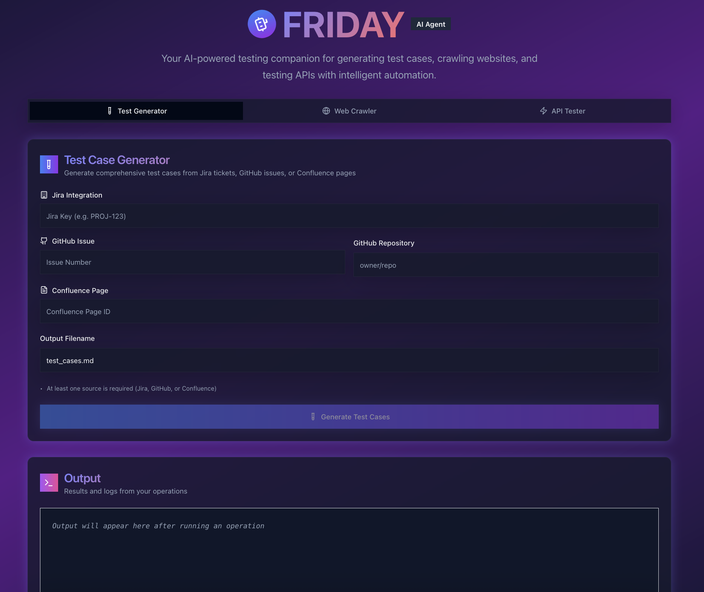

# FRIDAY - AI Test Agent

An AI-powered test agent that uses Generative AI and LangChain to automatically create test cases from Jira/GitHub issues and execute API tests, for a streamlined testing experience.

- **Web Application**: React-based UI running on port 3000 for visual interaction
- **CLI Application**: Command-line tool for quick test case generation and web crawling
- **REST API**: FastAPI service running on port 8080 for system integration

[](https://opensource.org/licenses/MIT)

<p align="center">
  
</p>

## ✨ Key Features

-   **AI-Powered Test Case Generation:** Leverage Google Gemini, OpenAI or mistral to generate test cases.
-   **Requirement Extraction:** Automatically extract requirements from Jira tickets or GitHub issues.
-   **Contextual Integration:** Incorporate relevant context from Confluence pages.
-   **LangChain Processing:** Utilize LangChain for advanced prompt engineering.
-   **Vectorized Storage:** Store and search documents efficiently using ChromaDB vectorization.
-   **Flexible Export:** Export test cases in JSON or Markdown format.
-   **Web Crawling:** Enhance context by creating embeddings using a web crawler.
-   **API Testing:** Execute API tests using OpenAPI specifications.

## ⚙️ Setup

### Prerequisites

-   Python 3.12+
-   [uv](https://docs.astral.sh/uv/) package manager
-   Gemini enabled or OpenAI API key 
-   Jira/GitHub and Confluence access credentials

### Installation

1.  **Install via Homebrew:**

    ```bash
    brew tap dipjyotimetia/friday
    brew install friday
    ```

2.  **Run setup:**

    ```bash
    friday setup
    ```

## ⚡️ Usage

### CLI Application

```bash
# From Jira
friday generate --jira-key PROJ-123 --confluence-id 12345 -o test_cases.md

# From GitHub
friday generate --gh-issue 456 --gh-repo owner/repo --confluence-id 12345 -o test_cases.md

# Crawl single domain
friday crawl https://example.com --provider openai --persist-dir ./my_data/chroma --max-pages 5

# Crawl multiple domains
friday crawl https://example.com --provider openai --persist-dir ./my_data/chroma --max-pages 10 --same-domain false

friday --help          # Show all commands
friday version         # Display version
friday generate --help # Show generation options
friday crawl --help    # Show crawling options
```

### REST API

```bash
uvicorn friday.api.app:app --reload --port 8080

# Generate test cases
curl -X POST http://localhost:8080/api/v1/generate \
  -H "Content-Type: application/json" \
  -d '{
    "jira_key": "PROJ-123",
    "confluence_id": "12345",
    "output": "test_cases.md"
  }'

# Run API tests
curl -X POST "http://localhost:8000/api/v1/testapi" \
  -H "Content-Type: multipart/form-data" \
  -F "base_url=https://petstore.swagger.io/v2/pet" \
  -F "spec_upload=@./docs/specs/petstore.yaml" \
  -F "output=report.md"
```

### Web Application

```bash
cd friday/app
npm install
npm start

Open http://localhost:3000 in your browser

* Generate test cases from Jira/GitHub issues
* Execute API tests with OpenAPI specifications
* Crawl websites for additional context
* View real-time test execution logs
```

## 🛠️ Development

1.  **Clone and setup:**

    ```bash
    git clone https://github.com/dipjyotimetia/friday.git
    cd friday
    uv sync
    ```

2.  **Configure environment:**

    ```bash
    cp .env.example .env
    # Add your credentials to .env
    ```

3.  **Run Tests:**

    ```bash
    uv run pytest tests/ -v
    ```

4.  **Format Code:**

    ```bash
    uv run ruff format
    ```

5.  **Deploy to Google Cloud:**

    ```bash
    chmod +x deploy.sh
    PROJECT_ID="your-project" REGION="us-west1" ./deploy.sh
    ```

## 🐳 Development Container Setup

This project uses Visual Studio Code's Development Containers feature, providing a consistent development environment via Docker.

### Prerequisites

1.  [Visual Studio Code](https://code.visualstudio.com/)
2.  [Docker Desktop](https://www.docker.com/products/docker-desktop)
3.  [Dev Containers extension](https://marketplace.visualstudio.com/items?itemName=ms-vscode-remote.remote-containers)

### Features

-   Python 3.12 with uv package management
-   Node.js 22 with npm
-   Docker-in-Docker support
-   Pre-configured VS Code extensions:
    -   Python and Pylance
    -   ESLint
    -   Prettier
    -   Docker
    -   Ruff (Python linter)

### Environment Variables

Required environment variables (set these before opening the dev container):

```sh
GOOGLE_CLOUD_PROJECT
GOOGLE_CLOUD_REGION
GITHUB_ACCESS_TOKEN
GITHUB_USERNAME
JIRA_URL
JIRA_USERNAME
JIRA_API_TOKEN
CONFLUENCE_URL
CONFLUENCE_USERNAME
CONFLUENCE_API_TOKEN
OPENAI_API_KEY
GOOGLE_API_KEY
```

### Services

The development environment includes three services:

-   `workspace`: Main development container
-   `api`: FastAPI backend service (port 8080)
-   app: Frontend application (port 3000)

### Getting Started

1.  Clone the repository
2.  Copy .env.example to .env and fill in your credentials
3.  Open in VS Code
4.  Click "Reopen in Container" when prompted
5.  The container will build and install all dependencies automatically

## 🗺️ Sequence Diagram

<details>
<summary>Expand Sequence diagram</summary>


</details>