# Friday Architecture Diagrams

This document provides visual representations of Friday's architecture, workflows, and component interactions.

## System Overview

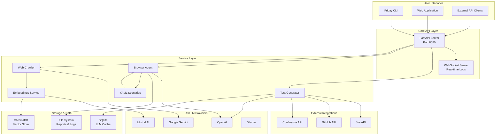

## Component Architecture

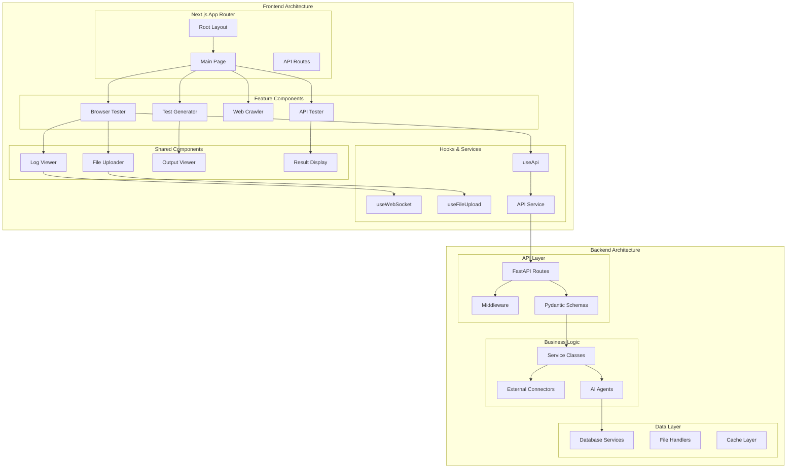

## Test Generation Workflow

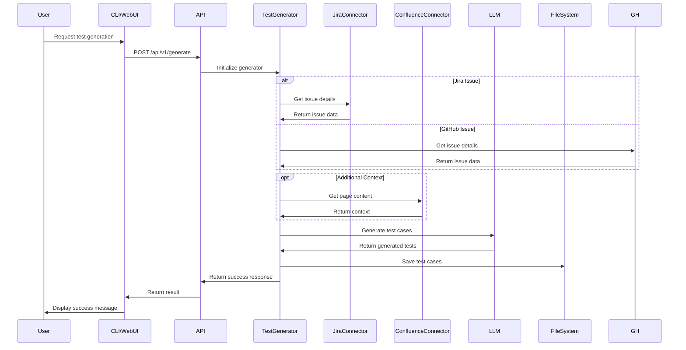

## Browser Testing Workflow

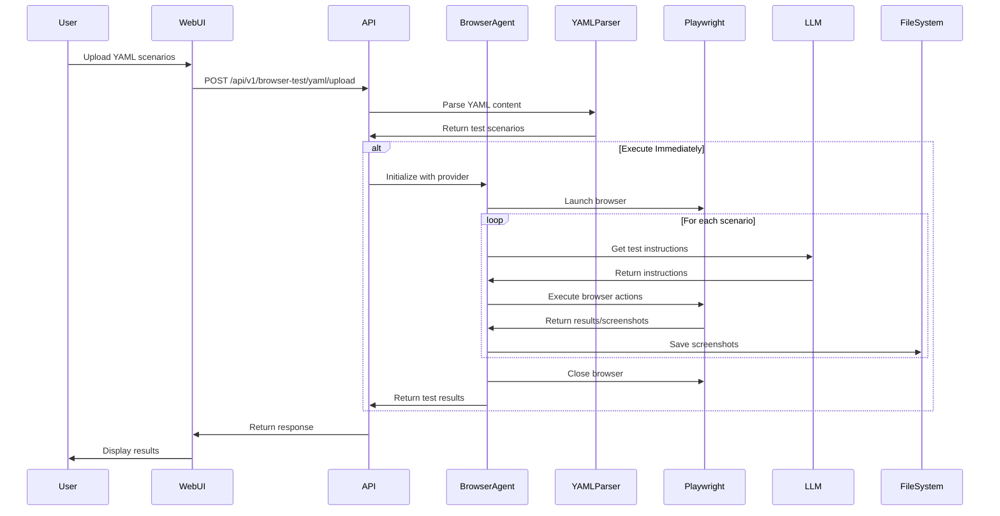

## Web Crawling Workflow

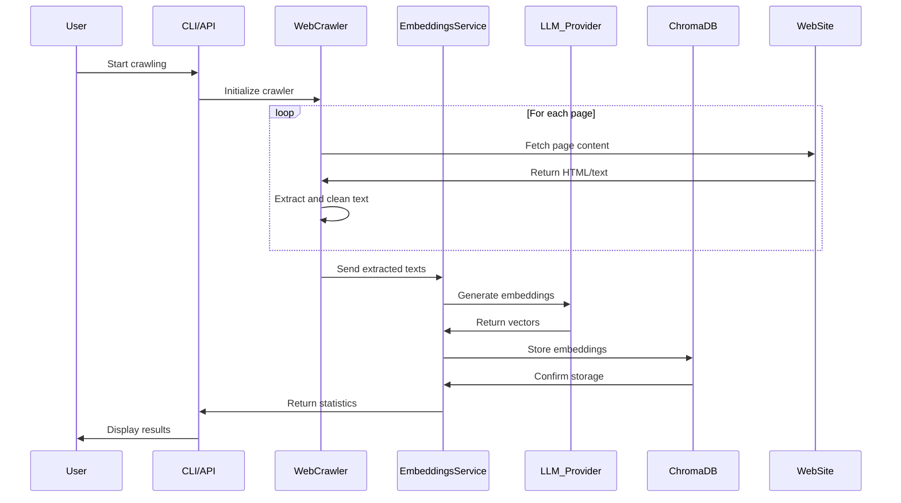

## WebSocket Communication Flow

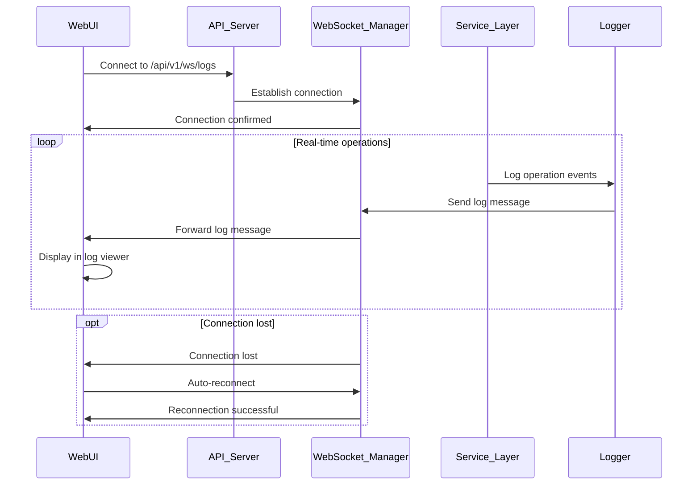

## Data Flow Architecture

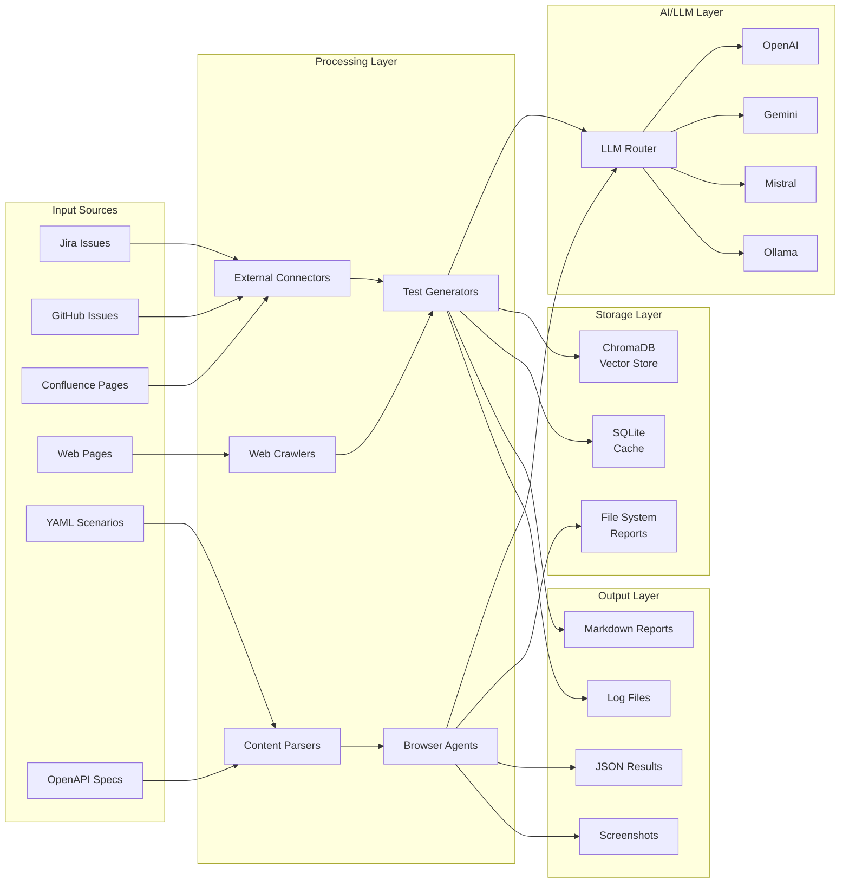

## Deployment Architecture

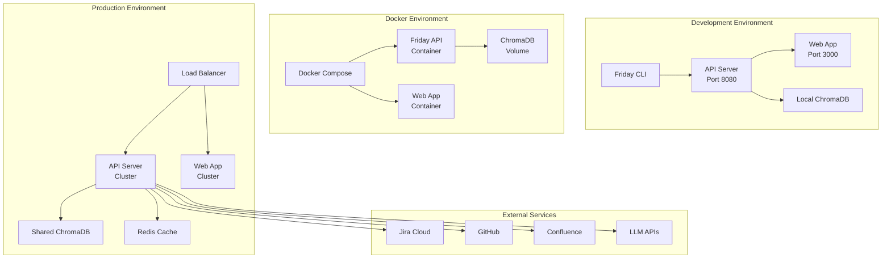

## Security Model

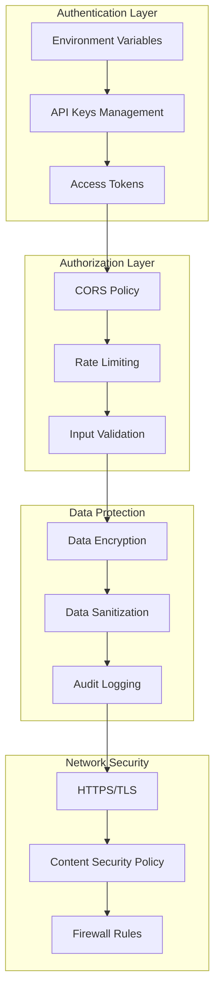

## Error Handling Flow

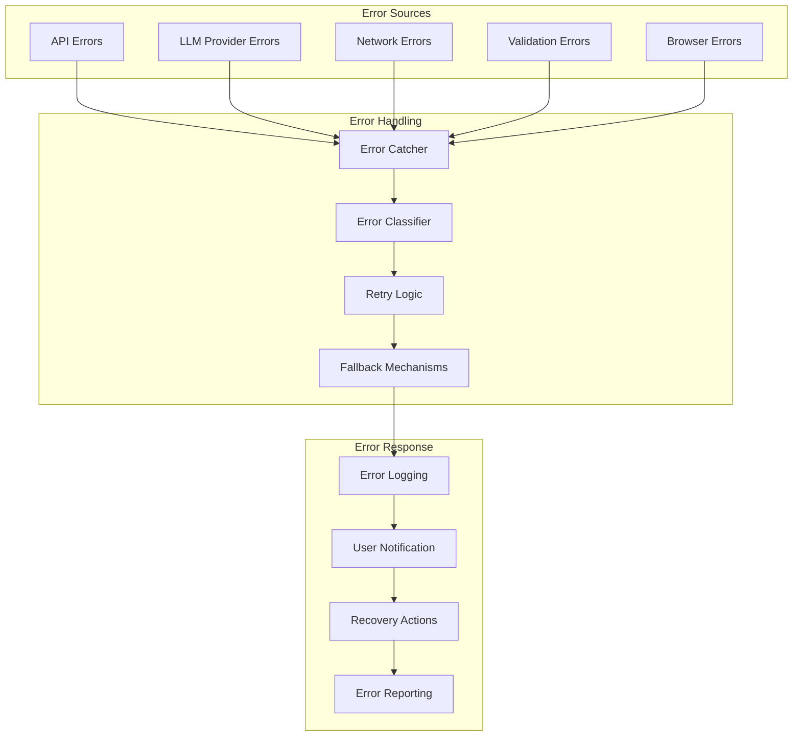

## CLI Command Flow

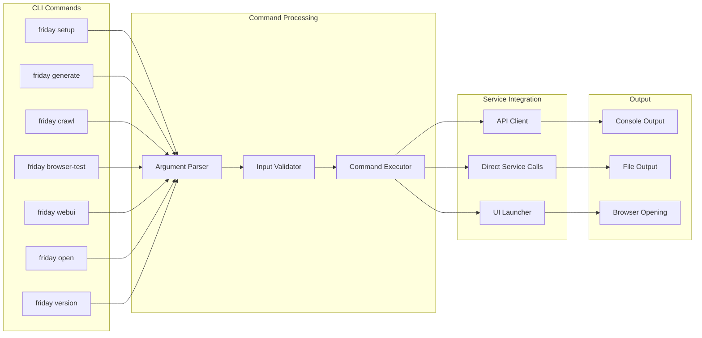

## Monitoring and Observability

```mermaid
graph TB
    subgraph "Application Metrics"
        API_METRICS[API Response Times]
        TEST_METRICS[Test Execution Stats]
        ERROR_METRICS[Error Rates]
        USAGE_METRICS[Feature Usage]
    end
    
    subgraph "Infrastructure Metrics"
        CPU_METRICS[CPU Usage]
        MEMORY_METRICS[Memory Usage]
        DISK_METRICS[Disk Usage]
        NETWORK_METRICS[Network I/O]
    end
    
    subgraph "Logging"
        APP_LOGS[Application Logs]
        ACCESS_LOGS[Access Logs]
        ERROR_LOGS[Error Logs]
        AUDIT_LOGS[Audit Logs]
    end
    
    subgraph "Alerting"
        HEALTH_ALERTS[Health Check Alerts]
        PERFORMANCE_ALERTS[Performance Alerts]
        ERROR_ALERTS[Error Threshold Alerts]
        RESOURCE_ALERTS[Resource Usage Alerts]
    end
    
    API_METRICS --> HEALTH_ALERTS
    TEST_METRICS --> PERFORMANCE_ALERTS
    ERROR_METRICS --> ERROR_ALERTS
    
    CPU_METRICS --> RESOURCE_ALERTS
    MEMORY_METRICS --> RESOURCE_ALERTS
    
    APP_LOGS --> ERROR_ALERTS
    ERROR_LOGS --> ERROR_ALERTS
```

These diagrams provide a comprehensive visual overview of Friday's architecture, helping developers understand the system's structure, data flow, and component interactions.