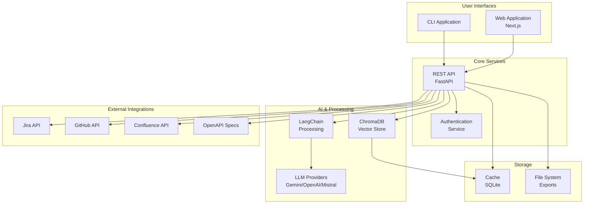
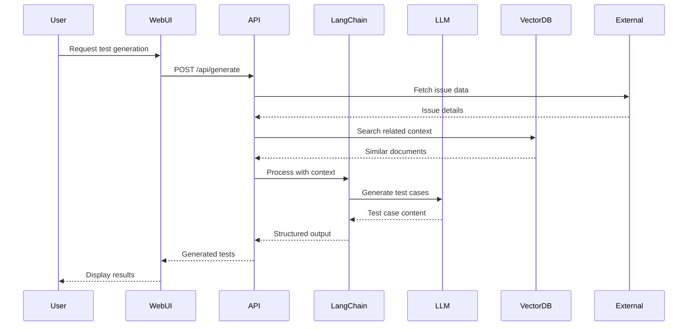
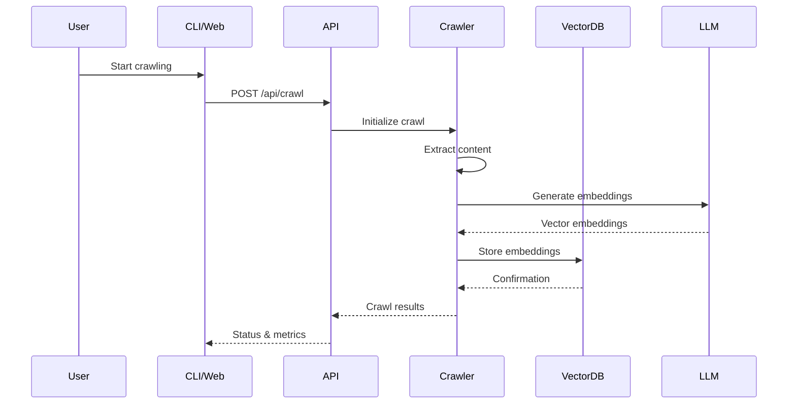

# FRIDAY System Architecture

## Overview

FRIDAY is a comprehensive AI-powered test agent built with a microservices architecture consisting of three main components:

1. **CLI Application** - Command-line interface for direct test generation
2. **REST API Service** - FastAPI backend providing AI test generation services  
3. **Web Application** - Next.js frontend for visual interaction

## System Architecture Diagram



## Component Architecture

### 1. CLI Application (`src/friday/cli.py`)

The command-line interface provides direct access to FRIDAY's capabilities:

```
friday/
├── cli.py              # Main CLI entry point
├── agents/             # AI agents for different tasks
│   ├── test_agent.py   # Test case generation agent
│   └── web_agent.py    # Web crawling agent
├── connectors/         # External service connectors
│   ├── jira.py         # Jira integration
│   ├── github.py       # GitHub integration
│   └── confluence.py   # Confluence integration
└── services/           # Core business logic
    ├── generator.py    # Test generation service
    ├── crawler.py      # Web crawling service
    └── embeddings.py   # Vector embedding service
```

**Key Features:**
- Direct test case generation from issues
- Web crawling for context building
- Export capabilities (JSON/Markdown)
- Configuration management

### 2. REST API Service (`src/friday/api/`)

FastAPI-based service providing HTTP endpoints:

```
api/
├── main.py             # FastAPI application
├── routes/             # API route definitions
│   ├── generate.py     # Test generation endpoints
│   ├── crawl.py        # Web crawling endpoints
│   ├── analyze.py      # Analysis endpoints
│   └── health.py       # Health check endpoints
├── middleware/         # Request/response middleware
│   ├── auth.py         # Authentication middleware
│   ├── cors.py         # CORS configuration
│   └── logging.py      # Request logging
└── models/             # Pydantic models
    ├── requests.py     # Request models
    └── responses.py    # Response models
```

**API Endpoints:**
- `POST /api/generate` - Generate test cases
- `POST /api/crawl` - Crawl web pages
- `POST /api/analyze` - Analyze OpenAPI specs
- `GET /api/health` - Health check

### 3. Web Application (`app/`)

Next.js-based frontend with modern React architecture:

```
app/
├── app/                # Next.js App Router
│   ├── layout.tsx      # Root layout
│   ├── page.tsx        # Home page
│   └── api/            # API routes (proxy)
├── components/         # React components
│   ├── features/       # Feature-specific components
│   │   ├── test-generator/
│   │   ├── api-tester/
│   │   └── web-crawler/
│   ├── shared/         # Reusable components
│   └── ui/             # UI primitives (shadcn/ui)
├── hooks/              # Custom React hooks
├── services/           # API integration layer
└── types/              # TypeScript definitions
```

## Data Flow Architecture

### Test Generation Workflow



### Web Crawling Workflow



## Technology Stack

### Backend
- **Framework**: FastAPI 0.100+
- **Language**: Python 3.12+
- **AI/ML**: LangChain, ChromaDB
- **LLM Providers**: Google Gemini, OpenAI, Mistral
- **Database**: SQLite (development), PostgreSQL (production)
- **Validation**: Pydantic
- **Testing**: pytest

### Frontend
- **Framework**: Next.js 14+ (App Router)
- **Language**: TypeScript 5+
- **Styling**: Tailwind CSS
- **UI Components**: shadcn/ui
- **State Management**: React hooks + Context
- **HTTP Client**: Fetch API

### Infrastructure
- **Containerization**: Docker & Docker Compose
- **Package Management**: uv (Python), npm (Node.js)
- **Deployment**: Cloud-native (configurable)
- **Monitoring**: Health checks, logging

## Security Architecture

### Authentication & Authorization
- API key-based authentication for external services
- JWT tokens for web application sessions
- Role-based access control (RBAC)
- Environment-based configuration

### Data Protection
- Sensitive data encryption at rest
- Secure API communications (HTTPS)
- Input validation and sanitization
- Rate limiting and CORS protection

## Deployment Architecture

### Development Environment
```yaml
services:
  friday-api:
    build: .
    ports: ["8080:8080"]
    environment:
      - ENV=development
  
  friday-web:
    build: ./app
    ports: ["3000:3000"]
    depends_on: [friday-api]
  
  chroma-db:
    image: chromadb/chroma
    ports: ["8000:8000"]
```

### Production Considerations
- Load balancing for API services
- Database clustering and replication
- CDN for static assets
- Monitoring and alerting
- Backup and disaster recovery

## Performance Considerations

### Scalability
- Horizontal scaling of API services
- Vector database optimization
- Caching strategies for embeddings
- Async processing for long-running tasks

### Optimization
- Connection pooling for external APIs
- Request/response compression
- Static asset optimization
- Database query optimization

## Monitoring & Observability

### Logging
- Structured logging with correlation IDs
- Centralized log aggregation
- Log rotation and retention policies

### Metrics
- API performance metrics
- LLM usage and costs
- Vector database performance
- User interaction analytics

### Health Checks
- Service availability monitoring
- Dependency health checks
- Resource utilization monitoring
- Automated alerting

## Future Architecture Considerations

### Planned Enhancements
- Microservices decomposition
- Event-driven architecture
- Multi-tenant support
- Advanced caching layers
- Machine learning model optimization

### Extensibility
- Plugin architecture for new LLM providers
- Custom test format exporters
- Integration marketplace
- Workflow automation capabilities
