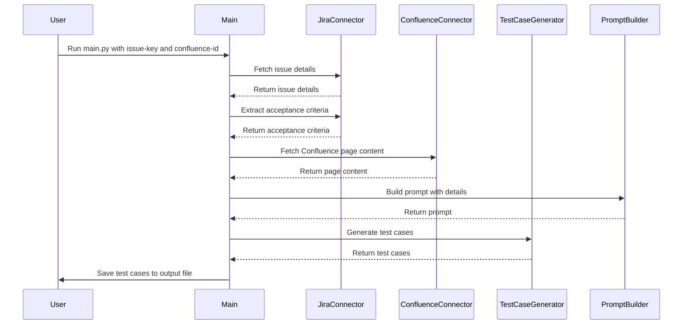

# Mermaid Sequence Diagram for FRIDAY Project

This document contains the mermaid sequence diagram for the FRIDAY project. The diagram illustrates the interaction between different components of the system during the process of generating test cases from Jira and Confluence.

## Diagram Description

1. **User**: Initiates the process by running the main script with the required parameters.
2. **Main**: The main script orchestrates the entire process.
3. **JiraConnector**: Fetches issue details and extracts acceptance criteria from Jira.
4. **ConfluenceConnector**: Retrieves additional context from Confluence pages.
5. **PromptBuilder**: Constructs the prompt for generating test cases.
6. **TestCaseGenerator**: Uses the prompt to generate detailed test cases.
7. **User**: Receives the generated test cases saved in the specified output file.

The sequence diagram provides a visual representation of the interactions and data flow between the components, helping to understand the overall process and identify potential areas for improvement.
