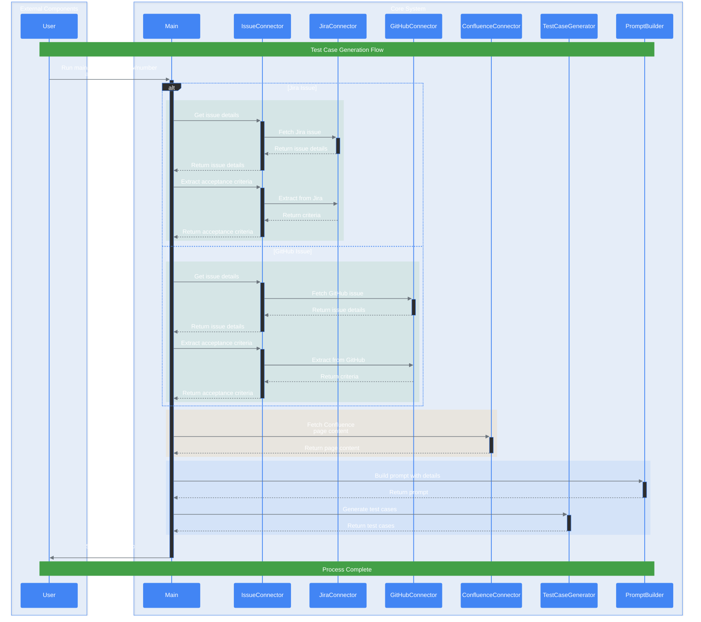

# Sequence Diagram for FRIDAY Project

This document contains the sequence diagram for the FRIDAY project. The diagram illustrates the interaction between different components of the system during the process of generating test cases from Jira and Confluence.

## Graphical

## Diagram Description

1. **User**: Initiates the process by running the main script with required parameters (issue-key/number and confluence-id).

2. **Main**: The main script that orchestrates the entire process and handles the flow between different components.

3. **IssueConnector**: Abstract connector layer that provides a unified interface for working with different issue tracking systems.
   - Handles routing to appropriate system (Jira/GitHub)
   - Standardizes issue data format across systems
   - Manages extraction of acceptance criteria

4. **JiraConnector**: Handles all Jira-specific operations:
   - Fetches issue details from Jira API
   - Extracts acceptance criteria from Jira issues
   - Manages Jira authentication and API interactions

5. **GitHubConnector**: Handles all GitHub-specific operations:
   - Fetches issue details from GitHub API
   - Extracts acceptance criteria from GitHub issues
   - Manages GitHub authentication and API interactions

6. **ConfluenceConnector**: Retrieves additional context from Confluence pages:
   - Fetches page content and attachments
   - Processes Confluence-specific formatting
   - Extracts relevant information for test case generation

7. **PromptBuilder**: Constructs the prompt for generating test cases:
   - Combines information from issues and Confluence
   - Structures data in a format suitable for test generation
   - Applies any necessary templating or formatting

8. **TestCaseGenerator**: Uses the constructed prompt to generate detailed test cases:
   - Processes the combined information
   - Generates comprehensive test scenarios
   - Formats output according to specified requirements

9. **User**: Receives the generated test cases saved in the specified output file.

The sequence diagram illustrates the enhanced flexibility of the system by:
- Supporting multiple issue tracking systems through abstraction
- Maintaining a consistent flow regardless of the source system
- Providing clear separation of concerns between components
- Enabling easy addition of new issue tracking systems in the future

This modular approach ensures that the system can be easily extended while maintaining a clear and organized structure for test case generation.
